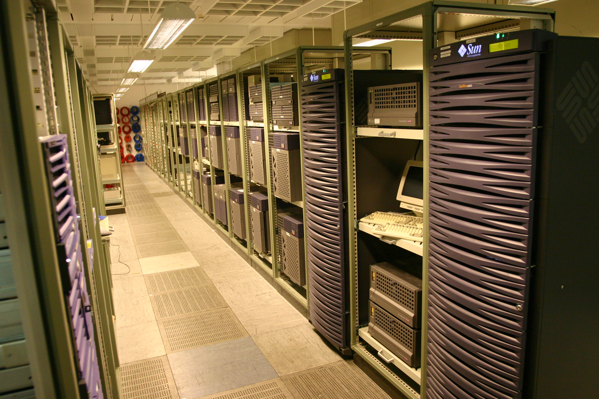
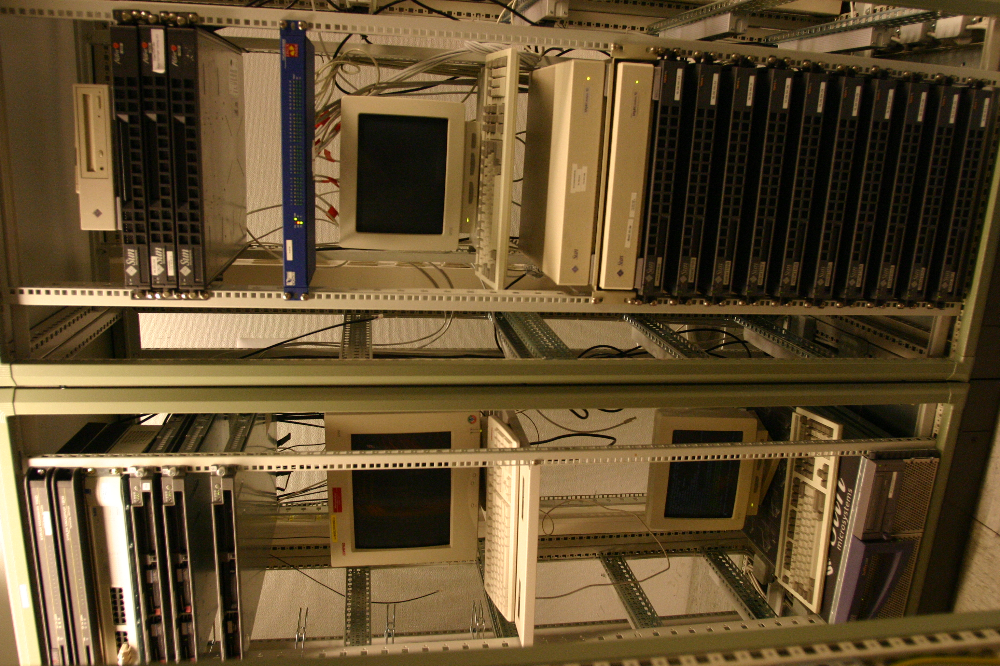
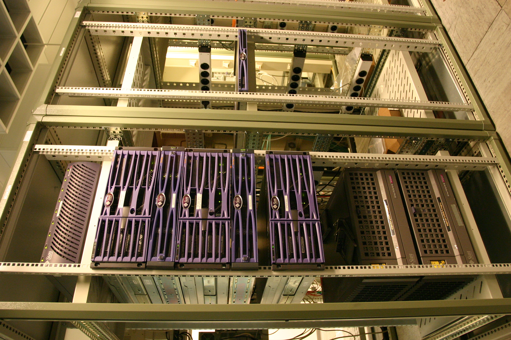
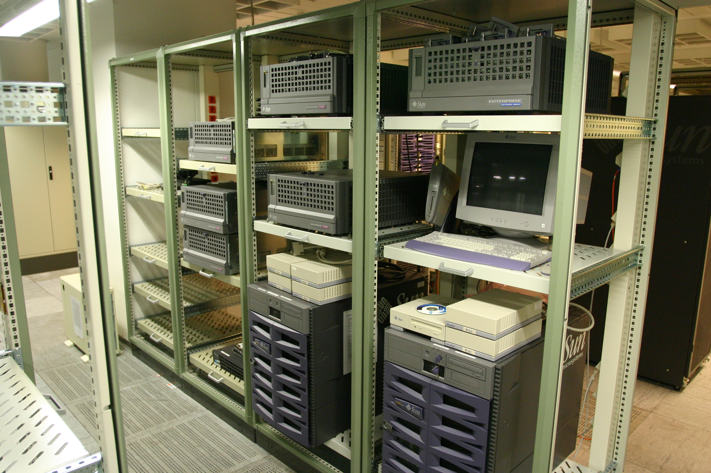

# Programming a Problem-Oriented Language

This is a book [Chuck Moore](https://colorforth.github.io/) wrote about 1970. It describes the software that became Forth.

I tried to read the document online, once, was bored and not so satisfied by the documents' layout that I hacked some perl to produce a PDF from it.

[Charles Havice Moore II](https://en.wikipedia.org/wiki/Charles_H._Moore) wrote Forth, named above, which was used on enterprise grade hardware like from SUN Microsystems. Such machines:

Well. Read more about #OpenBoot #OpenBootProm #PROM #MonitorMode #SUNMicrosystems #SunOS #Solaris on [Wikipedia](https://en.wikipedia.org/wiki/Forth_(programming_language)).

## DOWNLOAD THE PDF

You can download the PDF here [Programming a Problem-Oriented Language (PDF)](POL.pdf).

## Warning

Maybe incomplete. WIP (OLD, 2015...). Happy if you spot a bug and report it. Merci.

# PEACE - Free Julian Assange

<iframe width="560" height="315" src="https://www.youtube.com/embed/chDDhwsynVg" title="YouTube video player" frameborder="0" allow="accelerometer; autoplay; clipboard-write; encrypted-media; gyroscope; picture-in-picture; web-share" allowfullscreen></iframe>
